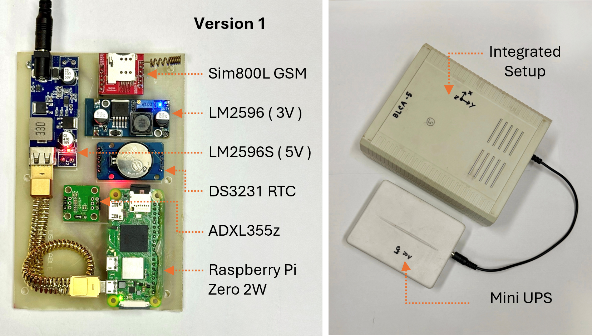
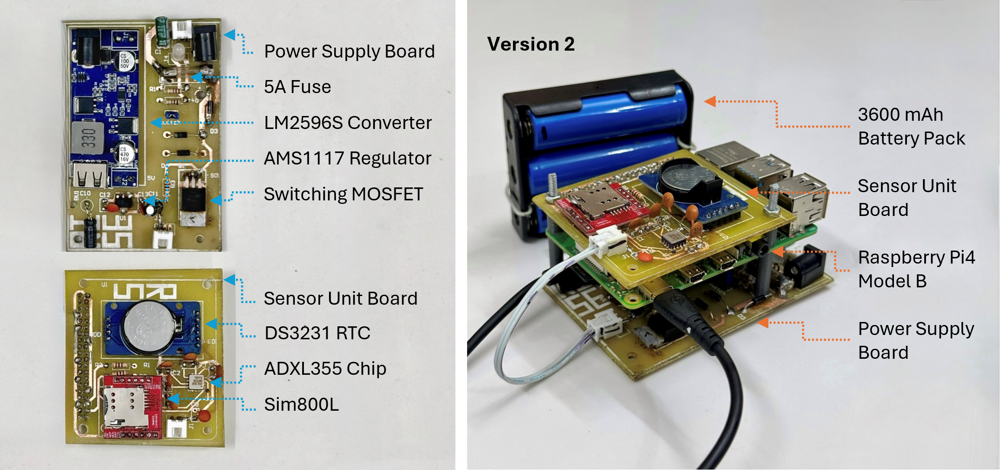
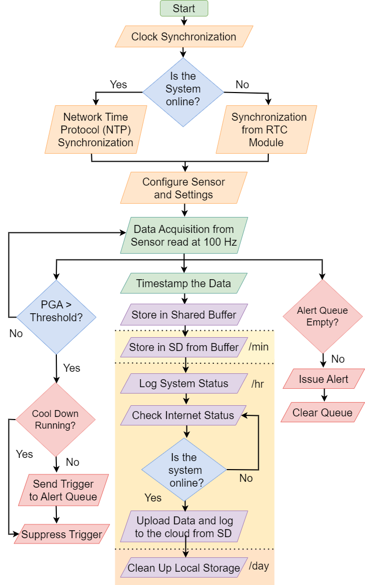
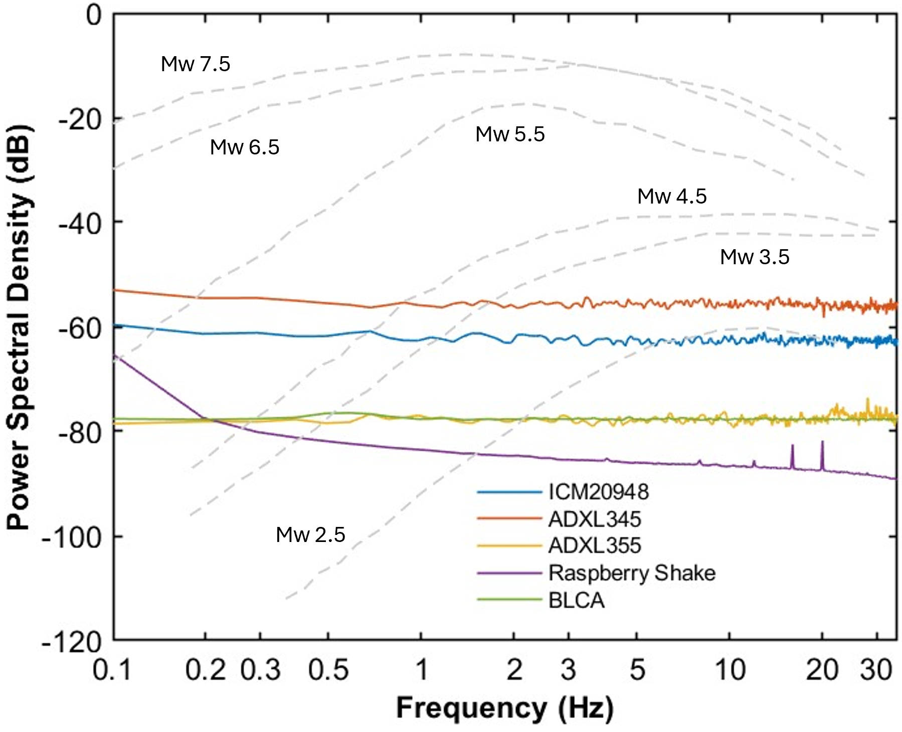
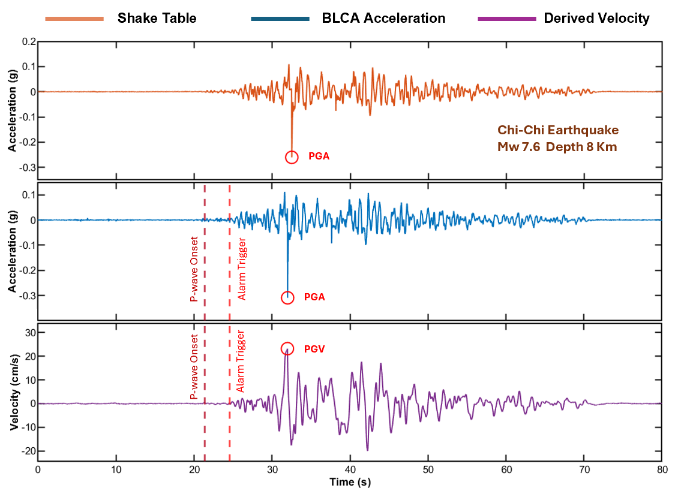

# BLCA — BUET Low-Cost Accelerometer

**Paper:** *Design and Development of a Low-Cost Earthquake Monitoring System Based on MEMS Accelerometer*

**Role (first author):** wrote the embedded firmware (C, Python), designed the carrier PCB, and performed the sensor noise characterization, two-point calibration, GUM uncertainty analysis, and STA/LTA post-analysis; led lab validation and multi-station field deployment.

  

## Results

- **7.425 s early-warning lead time** on a replayed 1999 Chi-Chi (Mw 7.6) waveform at 44.91 km, comparable to national systems (ShakeAlert 10–23 s, P-Alert 3–10 s, UrEDAS 3–15 s) at a fraction of the cost.
- **95–99 % input–output correlation** on the shake table; R = **0.987** on the Chi-Chi replay.
- Detects **Mw > 2.5 at 10 km**, matching a Raspberry Shake reference unit on far cheaper hardware.
- **Field-deployed** as a multi-station network across several cities; recorded multiple real earthquakes.
- Noise-limited detection floor **~0.020 m/s²** (2.04 mg), below the 0.098 m/s² (10 mg) alert threshold.

## Design decisions

Prototyped on an ESP32-S3 (dual-core Xtensa LX7, 512 KB SRAM) and a Raspberry Pi Zero 2 W (quad-core ARM Cortex-A53, 512 MB). The concurrent workload — acquisition, threshold evaluation, alert queuing, SD buffering, and compressed upload — exhausted the MCU's SRAM and flash and crashed it. The Pi runs all of it as three parallel pathways: real-time threshold evaluation feeding an alert queue, time-stamped SD buffering, and opportunistic cloud sync, sharing one buffer with a 3000 s cool-down that suppresses duplicate alerts.

Buffered records upload as Apache Parquet, ~70 % smaller than CSV, cutting transmission time and enabling efficient time-series queries.

Alerts go over Telegram when online and SMS via SIM800L when offline. Timing uses NTP when online and a DS3231 RTC when offline, keeping timestamps valid for multi-station correlation.

Power draw is 1.464 W at 78.8 % efficiency, with a 3500 mAh mini-UPS providing 5–6 h of autonomy through mains failures.

## Validation

- **Noise-floor characterization** of 3 candidate sensors plus reference via PSD (Welch, Hamming, 1024-sample, 50 % overlap). The ADXL355 measures −78 to −80 dB, ~20–25 dB below the ADXL345.
- **Full GUM uncertainty budget** with Type A and Type B sources combined, expanded at **k = 2 (95 %)**: U(a) = **2.69 mg**, U(Δt) = **0.360 ms**.
- **Frequency response** via sinusoidal excitation (0.2 / 1 / 5 / 10 Hz): R = **0.953–0.990**, SNR = **8.58–16.71 dB**.
- **Calibration and repeatability**: two-point gravity calibration; device-to-device RMS difference falls to 4–18 % of the alert threshold, so a single shared threshold holds across units.
- **P/S-wave picking** via STA/LTA on baseline-corrected, integrated velocity (0.075 Hz Butterworth high-pass to suppress integration drift). A preliminary STA/LTA study cuts anthropogenic false positives ~45×.

## System at a glance

| | |
|---|---|
| Sensor | ADXL355, tri-axial, 20-bit, 25 µg/√Hz, ±2 g |
| Controller | Raspberry Pi Zero 2 W (quad-core ARM Cortex-A53, 512 MB) |
| Sampling | 100 Hz, 3-axis (Nyquist 50 Hz; 20 Hz Butterworth LPF) |
| Detection | Peak-acceleration threshold @ 0.01 g, on-site |
| Comms | Telegram (online) / SIM800L SMS (offline) |
| Timing | NTP (online) / DS3231 RTC (offline) |
| Storage | SD buffer → cloud, Apache Parquet |
| Power | 12 V in, 5 V/3.3 V rails, 1.464 W, 3500 mAh UPS (5–6 h) |
| Unit cost | < $150 |

## Acknowledgment

Supported by the RISE Internal Research Grant (Project ID: 2023-02-027), BUET. Shake-table validation at IEER, CUET.

## Images

**Assembled hardware**

  

  

**Operational workflow**

  

**Validation**

  
  

